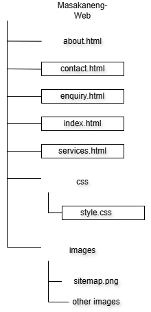

# Masakaneng Soup Kitchen Website

**Student:** Khomotso Mojela  
**Student Number:** ST10508982  
**Module:** WEDE5020

---

## Project Overview

Masakaneng Soup Kitchen is a community-based organisation that provides meals to vulnerable individuals and families. This website aims to raise awareness, attract volunteers, and facilitate donations.

---

## Website Goals and Objectives

- Raise awareness about food insecurity in the community
- Attract volunteers to support daily operations
- Accept donations (food and funds)
- Share upcoming events and community drives

---

## Key Features and Functionality

- Responsive navigation menu
- Hero section with call-to-action
- Enquiry/volunteer form
- Google Map integration
- Gallery of community work

---

## Timeline and Milestones

| Milestone                        | Date           |
| -------------------------------- | -------------- |
| Part 1 (Planning & HTML)         | August 2026    |
| Part 2 (CSS & Responsive Design) | September 2026 |
| Part 3 (JavaScript & SEO)        | October 2026   |

---

## Part 1 Details

- Two project proposals submitted
- Content researched and gathered
- Sitemap created
- HTML structure built with 5 pages
- GitHub repository set up

---

## Sitemap

---

## Changelog

- 12/08/2026: Initial README created. HTML structure added.

---

## References

Masakaneng Soup Kitchen, 2026. _Masakaneng Soup Kitchen_ [Facebook page]. Available at: < https://www.facebook.com/profile.php?id=61560964268377 > [Accessed 12 August 2026].

W3Schools, 2026. _HTML Tutorial_. Available at: < https://www.w3schools.com/html/ > [Accessed 12 August 2026].
